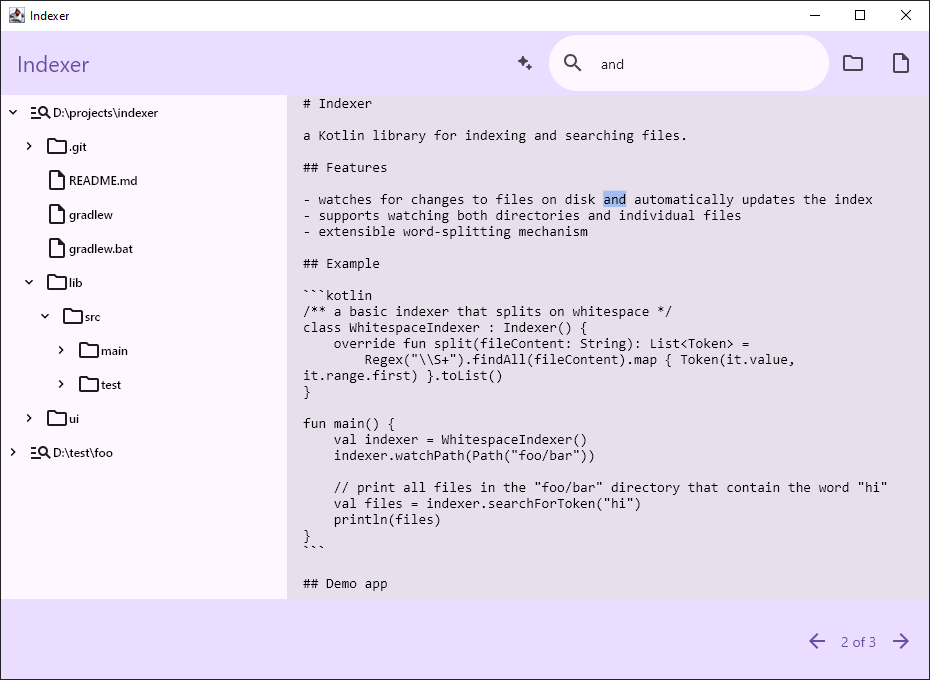

# Indexer

a Kotlin library for indexing and searching files.

## Features

- watches for changes to files on disk and automatically updates the index
- supports watching both directories and individual files
- extensible word-splitting mechanism

## Example

```kotlin
/** a basic indexer that splits on whitespace */
class WhitespaceIndexer : Indexer() {
    override fun split(fileContent: String): List<Token> =
        Regex("\\S+").findAll(fileContent).map { Token(it.value, it.range.first) }.toList()
}

fun main() {
    val indexer = WhitespaceIndexer()
    indexer.watchPath(Path("foo/bar"))
    
    // print all files in the "foo/bar" directory that contain the word "hi"
    println(indexer.searchForToken("hi"))

    // print all files that contain both the words "hi" and "bye"
    println(indexer.searchForAllTokens(setOf("hi", "bye")))
    
    // print all files that contain either the word "hi" or "bye"
    println(indexer.searchForAnyTokens(setOf("hi", "bye")))
}
```

## Demo app

This repo contains a demo app using the library written in Kotlin Compose.

Note:

- the search box in this demo app uses the `searchForAnyTokens` method (see [examples above](#example)), splitting the contents of the search field by whitespace
- this demo app does not include binary files in the search


